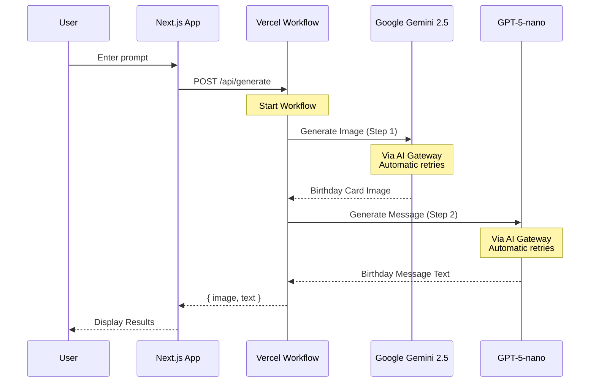

# Birthday Card Generator

**Birthday Card Generator** is an AI-powered application that generates custom birthday cards with images and personalized messages using Vercel Workflow and AI Gateway.

## ✨ Features

- 🎨 **AI-generated birthday card images** using Google Gemini 2.5 Flash Image
- ✍️ **Personalized birthday messages** using GPT-5-nano
- 🔄 **Resilient workflow processing** with automatic retries
- 💬 **Chat-like interface** with modern InputGroup UI
- ⚡ **Serverless architecture** powered by Vercel Workflow
- 🎯 **AI Gateway integration** - no API keys needed!

## 🚀 How It Works

When you describe a birthday card, the app automatically:

1. 🎨 Generates a birthday card image using Google Gemini 2.5 Flash Image via AI Gateway
2. ✍️ Creates a heartfelt birthday message using GPT-5-nano via AI Gateway
3. 📤 Returns both the image and text to display in the UI



## 🏗️ Architecture

### Workflow Steps

Each step in the birthday card generation workflow is isolated and runs with automatic retry handling:

**Step 1: Generate Image** (`generate-image.ts`)

- 🎨 Uses Google Gemini 2.5 Flash Image model
- 🌐 Routed through Vercel AI Gateway
- 🔄 Automatic retry handling for transient failures

**Step 2: Generate Message** (`generate-message.ts`)

- ✍️ Uses GPT-5-nano model
- 🌐 Routed through Vercel AI Gateway
- 🔄 Automatic retry handling for transient failures

### Orchestration

The main workflow (`generate-birthday-card.ts`) orchestrates both steps sequentially, ensuring:

- 📊 Comprehensive logging and timing metrics
- 🔄 Error handling with proper error propagation
- 📈 Performance tracking for the entire workflow

## 🛠️ Tech Stack

- ⚡ **Framework**: Next.js 15 with App Router and React 19
- 🔄 **Workflow**: Vercel Workflow (alpha)
- 🤖 **AI**: Google Gemini 2.5 Flash Image & GPT-5-nano via AI Gateway
- 🎨 **UI**: shadcn/ui + Tailwind CSS 4
- 🔒 **Type Safety**: TypeScript + Zod
- 📝 **Forms**: React Hook Form

## 🚀 Deploy to Vercel

The easiest way to deploy is using Vercel:

[](https://vercel.com/new/clone)

No environment variables or external services required - AI Gateway handles all authentication automatically!

## 💻 Local Development

### Prerequisites

- 🟢 Node.js 18+
- 📦 pnpm (recommended)

### Setup

1. Clone the repository:

```bash
git clone https://github.com/vercel/workflow-examples.git
cd workflow-examples/birthday-card-generator
```

2. Install dependencies:

```bash
pnpm install
```

3. Run the development server:

```bash
pnpm dev
```

Open [http://localhost:3000](http://localhost:3000) to see your app.

No `.env.local` needed! AI Gateway handles authentication automatically when deployed to Vercel.

## 📜 Scripts

- 🚀 `pnpm dev` - Start development server with Turbopack
- 🏗️ `pnpm build` - Build for production
- ✅ `pnpm check` - Run linting checks
- ✨ `pnpm format` - Format code with Biome

## 📁 Project Structure

```
birthday-card-generator/
├── app/
│   ├── api/
│   │   └── generate/
│   │       └── route.ts              # Workflow API route
│   ├── layout.tsx
│   └── page.tsx
├── workflows/
│   ├── generate-birthday-card.ts     # Main workflow orchestrator
│   ├── generate-image.ts             # Step 1: Generate image
│   └── generate-message.ts           # Step 2: Generate message
├── components/
│   ├── form.tsx                      # Main form with InputGroup UI
│   ├── header.tsx
│   └── ui/                           # shadcn/ui components
├── env.ts                            # Environment config (empty - no vars needed!)
└── package.json
```

## 🔐 Environment Variables

None required! 🎉

The application uses Vercel AI Gateway which automatically handles authentication when deployed to Vercel. No API keys needed for local development or production.

## 📊 Observability

The app includes comprehensive logging for monitoring and debugging:

- 🔄 `[WORKFLOW]` - Workflow-level events and timing
- 📝 Step completion logs with character counts and durations
- ⚠️ Error logs with timing and context

All logs include timestamps and duration metrics for performance tracking.

## 🤝 Contributing

Contributions are welcome! Please feel free to submit a Pull Request. Our [Contributing Guide](../../.github/CONTRIBUTING.md) has more information on how to get started.

## 📄 License

MIT
